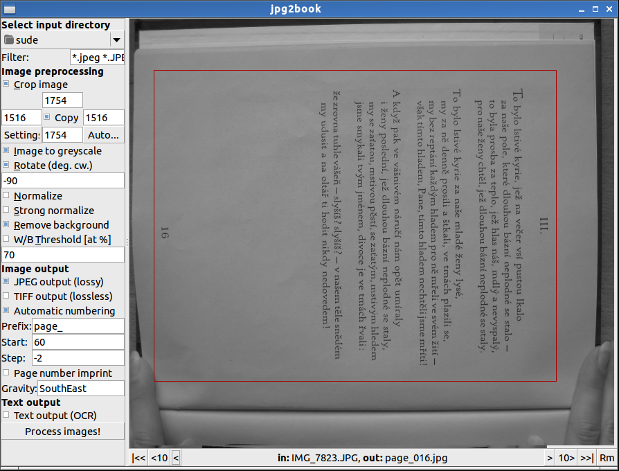
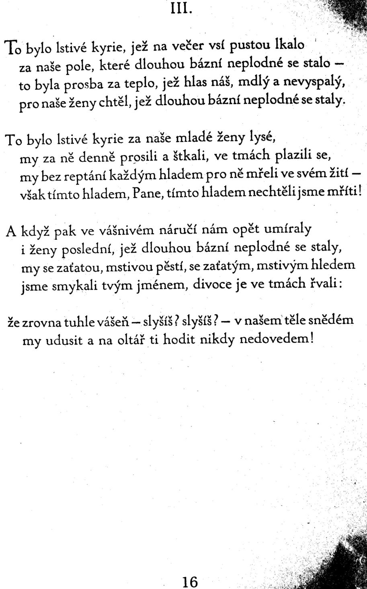

Jpg2book -- easily crop many photographed pages, convert them and number them correctly

## Requirements
some modern linux distro (not tested under Windows)
python, pygtk
imagemagick

optionally:
 * 'whiteboard' (Fred scripts http://www.fmwconcepts.com/imagemagick/whiteboard/) for the "remove background" option, put into ~/bin/whiteboard
 * 'tesseract' OCR for the "text output" option
 * 'cuneiform' OCR for 'batch_ocr.sh'

Tested on Ubuntu 10.10 and 15.04.

## Short usage
To crop, click left mouse button to set top-right corner, right mouse button to set bottom-right corner, or drag middle mouse button to move tthe cropping region.

Proceed to next images, making sure that the page numbers match and that the crop region matches to the text. By default, any new crop region settings apply to all following images. You may want to remove duplicit images using the "Rm" button at bottom right.

Use the "remove background" option for sharp text and WB drawings. Use "normalize" or "strong normalize" for documents that contain color/greyscale images"

Do not forget to make the pages rotate properly ("90 deg" = clockwise, "-90" = CCW)

## Essential files 
 * 'jpg2book' -- the executable python program
 * 'cropregion' -- custom module that automatically determines the crop region (experimental)
 * 'simplex.py' -- optimisation module for automatic cropping
 * 'jpg2book.xml' -- glade 2.0 XML containing the GUI
 * 'batch_ocr.sh' -- optional bash script that uses cuneiform OCR to produce one HTML document from multiple pages 

## License
Released under GPL 2.0

## Example of a screenshot and the output

